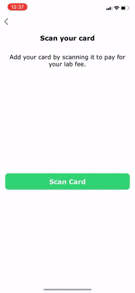

# CardScan
This repository contains the open source code for the [Bouncer](https://www.getbouncer.com) CardScan product.

[CardScan](https://getbouncer.com/scan) is a relatively small library that provides fast and accurate payment card
scanning.

CardScan is the foundation for CardVerify enterprise libraries, which validate the authenticity of payment cards as
they are scanned.

## Contents
* [Requirements](#requirements)
* [Demo](#demo)
* [Installation](#installation)
* [Authors](#authors)
* [License](#license)

## Requirements
* Xcode 11 or higher
* iOS 11 or higher (but the scanning view controllers require iOS 11.2 or higher to run)
* iOS 13 or higher for name and expiry extraction

## Demo
This repository contains a demonstration app for the CardScan product. To build and run the demo app, follow the
instructions in the [demo documentation](https://docs.getbouncer.com/card-scan/android-integration-guide#demo).

## Installation
Follow the [installation instructions documentation](https://docs.getbouncer.com/card-scan/ios-integration-guide#installation)
for installing CardScan into your app.

## Authors
Sam King, Jaime Park, Adam Wushensky, Zain ul Abi Din, and Andy Li

## License
This library is available under paid and free licenses. See the [LICENSE](LICENSE) file for the full license text.

### Quick summary
In short, this library will remain free forever for non-commercial applications, but use by commercial applications is
limited to 90 days, after which time a licensing agreement is required. We're also adding some legal liability
protections.

After this period commercial applications need to convert to a licensing agreement to continue to use this library.
* Details of licensing (pricing, etc) are available at [https://cardscan.io/pricing](https://cardscan.io/pricing), or
you can contact us at [license@getbouncer.com](mailto:license@getbouncer.com).

### More detailed summary
What's allowed under the license:
* Free use for any app for 90 days (for demos, evaluations, hackathons, etc).
* Contributions (contributors must agree to the [Contributor License Agreement](Contributor%20License%20Agreement))
* Any modifications as needed to work in your app

What's not allowed under the license:
* Commercial applications using the license for longer than 90 days without a license agreement.
* Using us now in a commercial app today? No worries! Just email
[license@getbouncer.com](mailto:license@getbouncer.com) and we’ll get you set up.
* Redistribution under a different license
* Removing attribution
* Modifying logos
* Indemnification: using this free software is ‘at your own risk’, so you can’t sue Bouncer Technologies, Inc. for
problems caused by this library

### Questions? Concerns?
Please email us at [license@getbouncer.com](mailto:license@getbouncer.com) or ask us on
[slack](https://getbouncer.slack.com).
